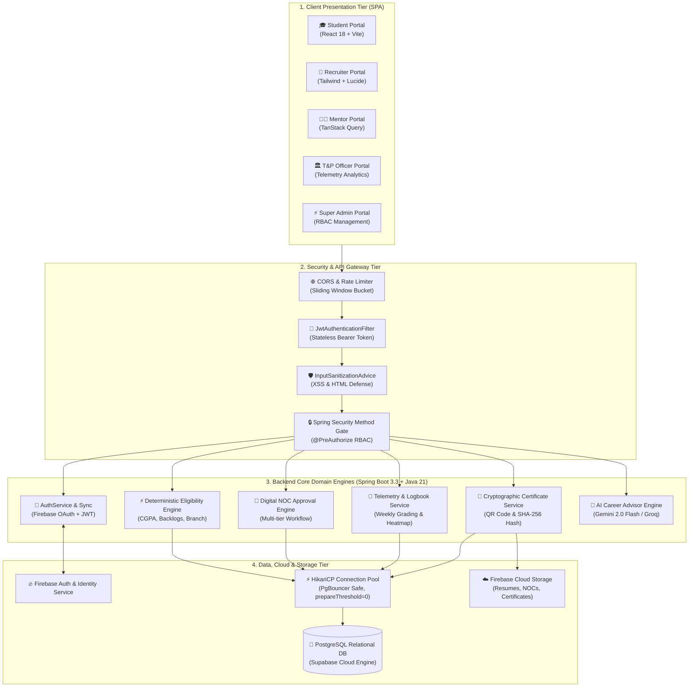
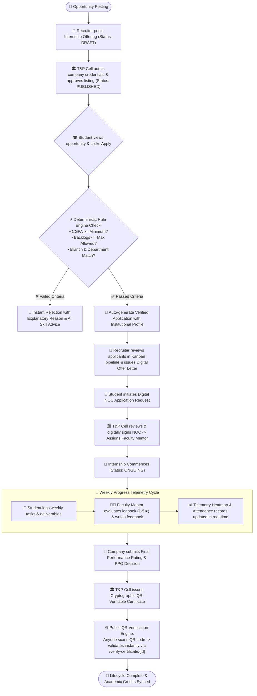
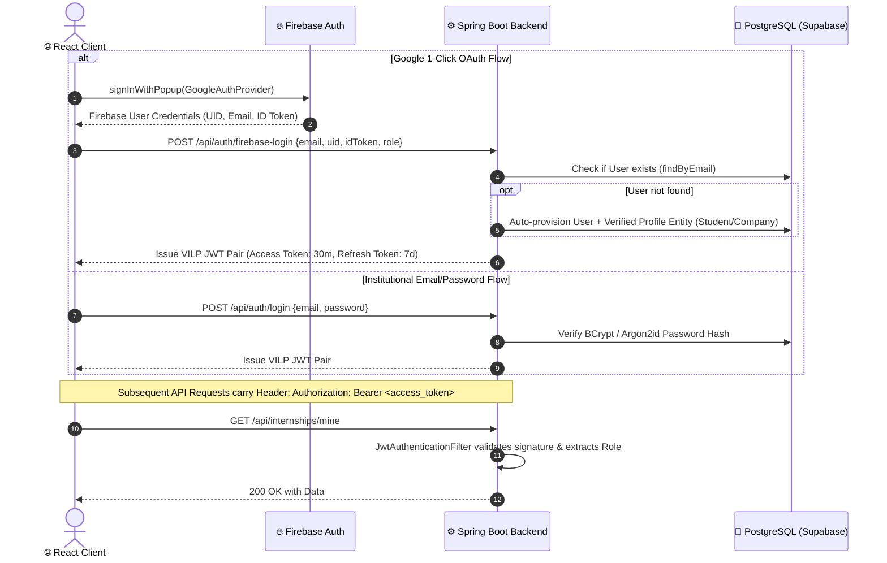
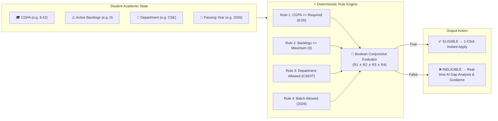

# 🏛️ VILP System Architecture & Flowcharts
### *Verified Internship Lifecycle Platform — Technical Architecture Blueprint*

---

## 1. High-Level 4-Tier System Architecture

---

## 2. End-to-End Internship Lifecycle Workflow Flowchart

---

## 3. Dual-Layer Authentication & Security Architecture

---

## 4. Deterministic Academic Eligibility Rule Engine Architecture

