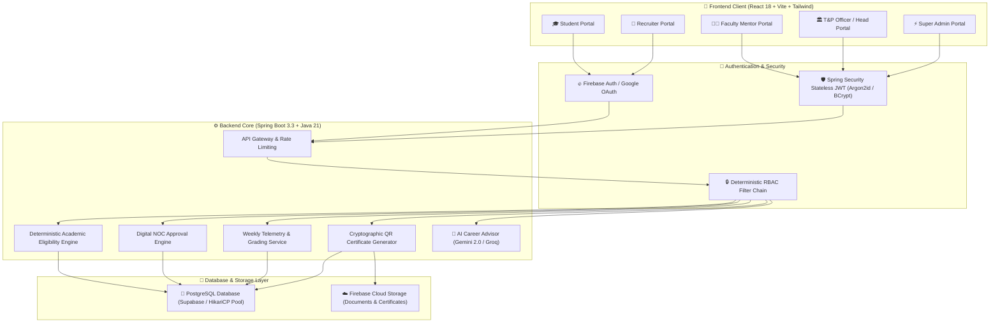
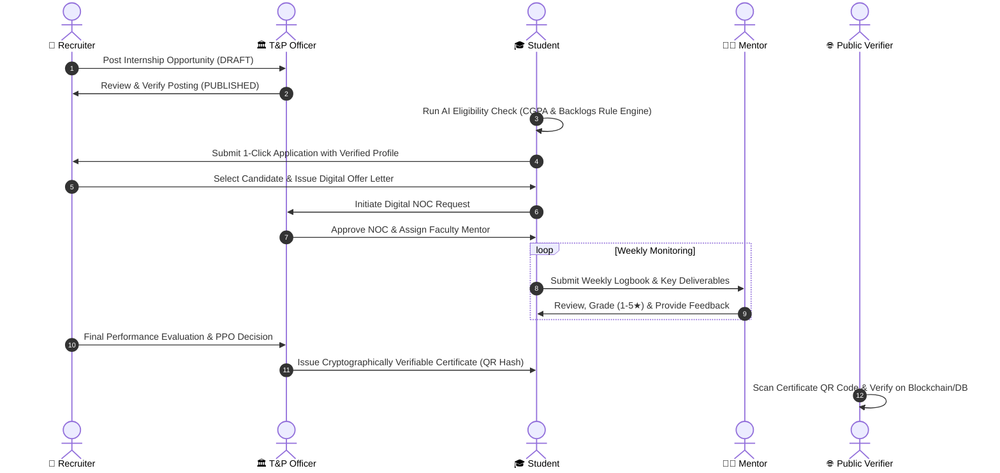

# 🚀 InternHack 2026 Hackathon — Project Documentation & Pitch Deck
## **VILP — Verified Internship Lifecycle Platform**
### *The Next-Generation Institutional Internship Ecosystem*

---

## 📑 Slide Deck Outline (Ready for PPT / PDF Export)

```
Slide 1: Title & Team Overview
Slide 2: Problem Statement & Industry Gaps
Slide 3: Proposed Solution — The VILP Ecosystem
Slide 4: Core Architecture & System Flowchart
Slide 5: Complete Technology Stack
Slide 6: 4-Way Stakeholder Workflows (Student, Company, Mentor, T&P)
Slide 7: Key Innovations & Killer Features
Slide 8: Why VILP Beats Internshala (Competitive Analysis)
Slide 9: Security, Verification & Cryptographic Trust
Slide 10: Future Roadmap, Impact & Scalability
```

---

## 🎯 Slide 1: Project Title & Team Overview

- **Project Title:** VILP (Verified Internship Lifecycle Platform)
- **Tagline:** Bridging Students, Recruiters, Faculty Mentors, and T&P Cells into a 100% Cryptographically Verified Ecosystem.
- **Hackathon:** InternHack 2026
- **Domain:** EdTech / Enterprise Placement & Workforce Automation

---

## ⚠️ Slide 2: Problem Statement & Existing Pain Points

### What's Wrong With Today's Internship Processes?
1. **The "Wild West" Job Boards (Internshala, LinkedIn):**
   - High volume of ghost jobs, unpaid exploitative postings, and unverified companies.
   - Zero connection to the student's actual college curriculum, academic credits, or attendance.
2. **The Paperwork Nightmare for Colleges:**
   - Physical NOC (No Objection Certificate) signing takes 7–14 days across multiple department heads.
   - No standardized way for faculty to monitor weekly student progress or attendance at external companies.
3. **Fake & Forged Certificates:**
   - Anyone can forge a PDF certificate in Canva or Photoshop.
   - Companies have no instant, tamper-proof way to verify if an applicant genuinely completed an internship.
4. **Disjointed Communication:**
   - 4 key stakeholders (Student, Company, Faculty Mentor, T&P Head) operate in separate silos (WhatsApp, Email, Physical Forms).

---

## 💡 Slide 3: The VILP Solution

VILP is an **Institutional Enterprise Platform** that unifies the entire internship lifecycle:
- **Pre-Internship:** AI-powered job discovery, deterministic academic eligibility validation (CGPA, backlogs, branch).
- **Onboarding:** Instant digital NOC approvals through a multi-tier authorization chain.
- **During Internship:** Real-time weekly logbook submissions with mentor grading, activity streak heatmaps, and telemetry.
- **Post-Internship:** QR-code verifiable completion certificates with cryptographic SHA-256 tamper detection and PPO tracking.

---

## 🏗️ Slide 4: System Architecture & Workflow Diagrams

### High-Level Architecture Flowchart



### Complete End-to-End Internship Lifecycle



---

## 💻 Slide 5: Comprehensive Technology Stack

| Layer | Technologies Used | Key Benefits |
|---|---|---|
| **Frontend Framework** | React 18, TypeScript, Vite | Sub-second load times, strict type safety, SPA responsiveness |
| **Styling & UI Components** | Tailwind CSS, Lucide React, Framer Motion | Modern clean aesthetic, responsive on Mobile, Tablet & Desktop |
| **State & API Management** | TanStack React Query, Axios with Interceptors | Automated caching, background refetching, token rotation |
| **Authentication** | Firebase Auth (Google OAuth) + Spring Security JWT | Dual auth: 1-click Google sign-in + Institutional RBAC |
| **Backend Framework** | Java 21, Spring Boot 3.3.x | Enterprise-grade multithreading, high throughput REST APIs |
| **Database & ORM** | PostgreSQL (Supabase Cloud), Spring Data JPA, Hibernate 6 | Relational data integrity, ACID compliance, PgBouncer pooling |
| **Schema Migration** | Flyway DB Migrations (V1 to V16) | Zero-downtime repeatable schema versioning |
| **AI & Recommendation** | Google Gemini 2.0 Flash + Groq LLaMA 3.3 | Resume gap analysis, real-time match scoring, skill roadmap |
| **Storage & Media** | Firebase Cloud Storage | High availability secure resume, offer letter, and certificate hosting |
| **Deployment & DevOps** | Vercel (Frontend CI/CD) + Render (Dockerized Backend) | Automatic continuous deployment on every git commit |

---

## 👥 Slide 6: The 4-Way Stakeholder Experience

### 1. 🎓 Student Portal
- **Smart Discover:** Browse internships matched to CGPA, branch, and technical skills.
- **1-Click Application:** Pre-verified institutional profiles eliminate tedious form-filling.
- **Weekly Logbooks:** Markdown submission interface with LeetCode-style activity heatmaps.
- **AI Career Advisor:** Personalized recommendations to bridge skill gaps before applying.

### 2. 🏢 Recruiter Portal
- **Zero Spam:** Every applicant has verified academic records (no forged CGPAs).
- **Fast-Track Hiring:** Pipeline kanban view (Applied &rarr; Shortlisted &rarr; Interview &rarr; Offered).
- **Direct PPO Conversion:** Turn top interns into full-time pre-placement offers directly inside the portal.

### 3. 👨‍🏫 Faculty Mentor Portal
- **Student Mentorship Tracking:** Monitor up to dozens of assigned interns in a single unified view.
- **Weekly Review & Grading:** Grade logbooks, flag irregular attendance, and award academic credit scores.

### 4. 🏛️ T&P Cell (Officer & Head) Portal
- **Live Institution Telemetry:** Real-time analytics on placement percentage, average stipend, branch breakdown.
- **Company & Opportunity Verification:** Gatekeep college campus drives from fraudulent recruiters.
- **Automated Digital NOCs:** Instant bulk approvals replace thousands of physical paper forms.

---

## 🔥 Slide 7: Killer Features & Innovation Highlights

1. ⚡ **Deterministic Academic Rule Engine:**
   Filters applicants mathematically against strict criteria (e.g., `CGPA >= 8.0 AND Active_Backlogs == 0 AND Branch == 'Computer Science'`) before an application can be submitted.
2. 🛡️ **Public QR-Verifiable Certificates:**
   Every certificate carries a cryptographic unique ID and public verification URL (`/verify-certificate/{id}`). Third-party recruiters can scan the QR code to verify authenticity in 1 second.
3. 📊 **LeetCode-Style Activity Heatmap:**
   Visual weekly contribution graph showing daily student learning activity and logbook consistency.
4. 🤖 **Generative AI Career Mentor:**
   Integrated with Gemini 2.0 Flash to analyze job requirements against student skill matrices and output targeted learning paths.

---

## ⚔️ Slide 8: Why VILP Beats Internshala

| Feature | **Internshala** | **VILP Platform** |
|---|---|---|
| **Target Audience** | Open retail market | Direct College / University Integration |
| **Credential Verification** | ❌ None (Self-declared) | ✅ 100% Institutional Verified (College DB) |
| **NOC Workflow** | ❌ Not available | ✅ End-to-end Automated Digital NOC |
| **Faculty Mentorship** | ❌ None | ✅ Weekly Progress Monitoring & Grading |
| **Certificate Trust** | ⚠️ Basic PDF | ✅ Cryptographic Public QR Verification |
| **Academic Credit Sync** | ❌ No connection to college | ✅ Direct gradebook & credit conversion |
| **Spam / Ghost Jobs** | ⚠️ Frequent complaints | 🛡️ 0% Spam (All recruiters vetted by T&P) |

---

## 🔒 Slide 9: Security, Architecture & Reliability

- **Stateless JWT with Token Rotation:** Short-lived access tokens (30 min) + secured refresh tokens (7 days).
- **Argon2id & BCrypt Hashing:** Enterprise password encryption standards.
- **Global Input Sanitization:** XSS & HTML injection defense across all REST endpoints.
- **PgBouncer Connection Pooling:** High-concurrency database resilience under peak campus drive loads.

---

## 🚀 Slide 10: Future Roadmap & Scalability

- **Phase 1 (Done):** Complete multi-role portal, digital NOC, logbook system, QR certificates.
- **Phase 2 (Upcoming):** WhatsApp/SMS Automated Alert Notifications for interview schedules.
- **Phase 3:** Blockchain-anchored verifiable credentials on Ethereum/Polygon Layer 2.
- **Phase 4:** AI Voice Agent for automated mock technical and HR interviews.

---

### 📥 How to submit for InternHack 2026:
1. **To create a PDF:** Open this document in VS Code/Chrome &rarr; Print to PDF (`Ctrl + P` &rarr; Save as PDF).
2. **To create PPTX:** Copy each slide heading and bullet points into PowerPoint or Google Slides.
