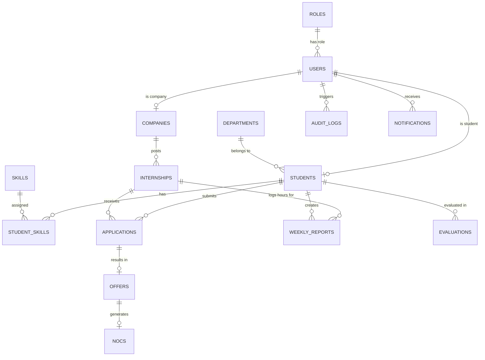

# 🗄️ VILP Relational Database Schema & Entity Relationship Map

---

## 1. Relational Entity Overview

---

## 2. Table Specifications & Migration History

### 1. `roles` (Flyway: `V1__create_roles.sql`)
- `id` BIGSERIAL PRIMARY KEY
- `name` VARCHAR(50) UNIQUE NOT NULL (`STUDENT`, `COMPANY`, `MENTOR`, `TNP_OFFICER`, `TNP_HEAD`, `SUPER_ADMIN`)
- `description` TEXT

### 2. `users` (Flyway: `V2__create_users.sql`)
- `id` UUID PRIMARY KEY
- `email` VARCHAR(255) UNIQUE NOT NULL
- `password_hash` VARCHAR(255)
- `google_subject` VARCHAR(255) UNIQUE
- `role_id` BIGINT NOT NULL REFERENCES `roles(id)`
- `status` VARCHAR(50) NOT NULL DEFAULT `'ACTIVE'` (`ACTIVE`, `SUSPENDED`, `DELETED`)
- `email_verified` BOOLEAN NOT NULL DEFAULT FALSE
- `verification_token` VARCHAR(255)
- `verification_token_expiry` TIMESTAMP WITH TIME ZONE
- `failed_login_attempts` INT NOT NULL DEFAULT 0
- `locked_until` TIMESTAMP WITH TIME ZONE
- `created_at`, `updated_at` TIMESTAMP WITH TIME ZONE

### 3. `departments` & `students` (Flyway: `V3__create_students.sql`)
- `departments`: `id` BIGSERIAL PRIMARY KEY, `name` VARCHAR(100) UNIQUE, `code` VARCHAR(20) UNIQUE.
- `students`: `id` UUID PRIMARY KEY, `user_id` UUID UNIQUE NOT NULL REFERENCES `users(id)`, `student_number` VARCHAR(50) UNIQUE NOT NULL, `full_name` VARCHAR(150) NOT NULL, `department_id` BIGINT REFERENCES `departments(id)`, `branch` VARCHAR(100), `semester` INT, `cgpa` NUMERIC(4,2), `backlogs` INT DEFAULT 0, `passing_year` INT, `phone` VARCHAR(20), `linkedin_url` VARCHAR(255), `portfolio_url` VARCHAR(255), `about` TEXT, `verification_status` VARCHAR(50) DEFAULT `'REGISTERED'`, `profile_completion` INT DEFAULT 0.
- `skills` & `student_skills`: Skills junction table.

### 4. `companies` (Flyway: `V4__create_companies.sql`)
- `id` UUID PRIMARY KEY, `user_id` UUID UNIQUE NOT NULL REFERENCES `users(id)`, `name` VARCHAR(200) NOT NULL, `description` TEXT, `website` VARCHAR(255), `industry` VARCHAR(100), `size` VARCHAR(50), `headquarters` VARCHAR(150), `contact_email` VARCHAR(255), `contact_phone` VARCHAR(20), `contact_person_name` VARCHAR(150), `verification_status` VARCHAR(50) DEFAULT `'PENDING'`, `verified_by` UUID, `verified_at` TIMESTAMP.

### 5. `internships` (Flyway: `V5__create_internships.sql`)
- `id` UUID PRIMARY KEY, `company_id` UUID NOT NULL REFERENCES `companies(id)`, `title` VARCHAR(200) NOT NULL, `description` TEXT NOT NULL, `mode` VARCHAR(50) NOT NULL (`REMOTE`, `ON_SITE`, `HYBRID`), `location` VARCHAR(150), `stipend_amount` NUMERIC(10,2), `stipend_currency` VARCHAR(10) DEFAULT `'INR'`, `duration_weeks` INT NOT NULL, `openings` INT NOT NULL DEFAULT 1, `application_deadline` TIMESTAMP WITH TIME ZONE NOT NULL, `start_date`, `end_date` DATE, `min_cgpa` NUMERIC(4,2), `max_backlogs` INT, `status` VARCHAR(50) DEFAULT `'DRAFT'` (`DRAFT`, `PENDING_VERIFICATION`, `OPEN`, `CLOSED`, `CANCELLED`).

### 6. `applications` (Flyway: `V6__create_applications.sql`)
- `id` UUID PRIMARY KEY, `internship_id` UUID NOT NULL REFERENCES `internships(id)`, `student_id` UUID NOT NULL REFERENCES `students(id)`, `status` VARCHAR(50) DEFAULT `'APPLIED'` (`APPLIED`, `SHORTLISTED`, `INTERVIEW_SCHEDULED`, `SELECTED`, `REJECTED`, `WITHDRAWN`, `CANCELLED_OFFER_ACCEPTED`), `cover_letter` TEXT, `applied_at` TIMESTAMP WITH TIME ZONE.

### 7. `documents` (Flyway: `V7__create_documents.sql`)
- `id` UUID PRIMARY KEY, `entity_type` VARCHAR(50) NOT NULL (`STUDENT`, `COMPANY`, `OFFER`, `CERTIFICATE`), `entity_id` UUID NOT NULL, `document_type` VARCHAR(50) NOT NULL, `file_url` VARCHAR(500) NOT NULL, `original_filename` VARCHAR(255) NOT NULL, `mime_type` VARCHAR(100) NOT NULL, `size_bytes` BIGINT NOT NULL, `sha256_hash` VARCHAR(64) NOT NULL, `status` VARCHAR(50) DEFAULT `'UPLOADED'`, `uploaded_by` UUID NOT NULL.

### 8. `offers` & `noc_requests` (Flyway: `V9__create_offers_and_noc.sql`)
- `offers`: `id` UUID PRIMARY KEY, `application_id` UUID UNIQUE NOT NULL REFERENCES `applications(id)`, `stipend_amount` NUMERIC(10,2), `start_date`, `end_date` DATE NOT NULL, `status` VARCHAR(50) DEFAULT `'OFFERED'` (`OFFERED`, `ACCEPTED`, `REJECTED`, `EXPIRED`, `REVOKED`), `terms_and_conditions` TEXT, `response_date` TIMESTAMP.
- `noc_requests`: `id` UUID PRIMARY KEY, `offer_id` UUID UNIQUE NOT NULL REFERENCES `offers(id)`, `verification_code` VARCHAR(50) UNIQUE NOT NULL, `status` VARCHAR(50) DEFAULT `'PENDING_REVIEW'` (`PENDING_REVIEW`, `APPROVED`, `REJECTED`), `issued_at` TIMESTAMP, `signed_by` UUID.

### 9. `weekly_reports` & `evaluations` (Flyway: `V10__create_logbooks_and_evaluations.sql`)
- `weekly_reports`: `id` UUID PRIMARY KEY, `internship_id` UUID NOT NULL, `student_id` UUID NOT NULL, `week_number` INT NOT NULL, `hours_worked` INT NOT NULL DEFAULT 40, `tasks_summary` TEXT NOT NULL, `status` VARCHAR(50) DEFAULT `'SUBMITTED'` (`DRAFT`, `SUBMITTED`, `APPROVED`, `REVISIONS_REQUESTED`), `mentor_feedback` TEXT, `rating` INT.
- `evaluations`: `id` UUID PRIMARY KEY, `internship_id` UUID NOT NULL, `student_id` UUID NOT NULL, `evaluator_id` UUID NOT NULL, `technical_skills_rating` INT, `communication_rating` INT, `punctuality_rating` INT, `overall_rating` INT, `ppo_recommended` BOOLEAN DEFAULT FALSE.
